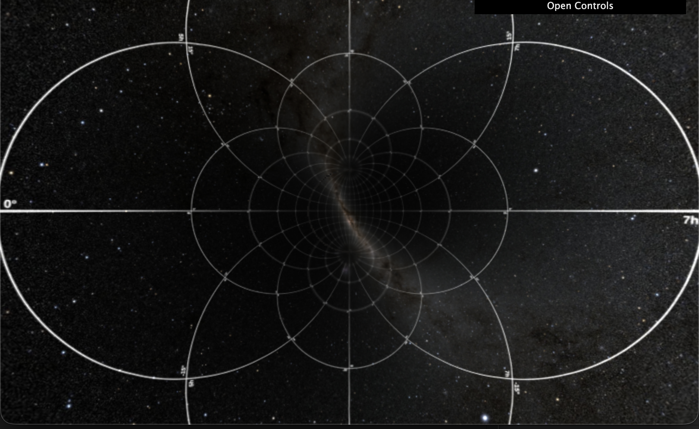

# AberrationTest
Simple visualization of the deformation from relativistic aberration. The current version does not simulate the changes in brightness due to the headlight effect nor the Doppler effect.

Click below to execute in browser.

## Attributions
1. The controllers have been implemented with [dat.gui](https://github.com/dataarts/dat.gui). See license at [https://github.com/vsr83/OrbitsGL/tree/main/imports/LICENSE.dat.gui.txt](imports/LICENSE.dat.gui.txt).
2. Deep Star Maps 2020, NASA/Goddard Space Flight Center Scientific Visualization Studio. Gaia DR2: ESA/Gaia/DPAC. [link](https://svs.gsfc.nasa.gov/4851/) 
3. Tampere Photo, 360 degree panorama from Hämeenpuisto, Tampere - VirtualTampere.com, Rami - JJ-Net Group Oy. [link](https://commons.wikimedia.org/wiki/File:360_panorama_from_H%C3%A4meenpuisto,_Tampere.jpg)